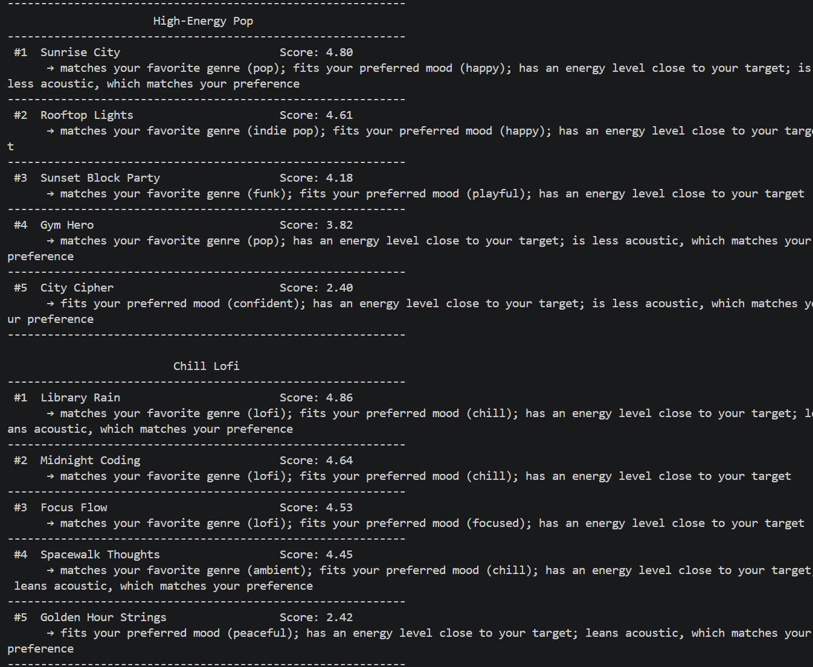
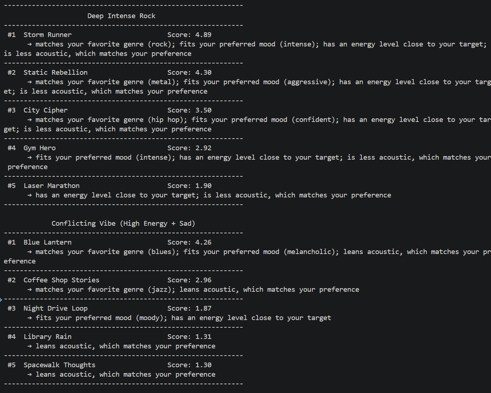
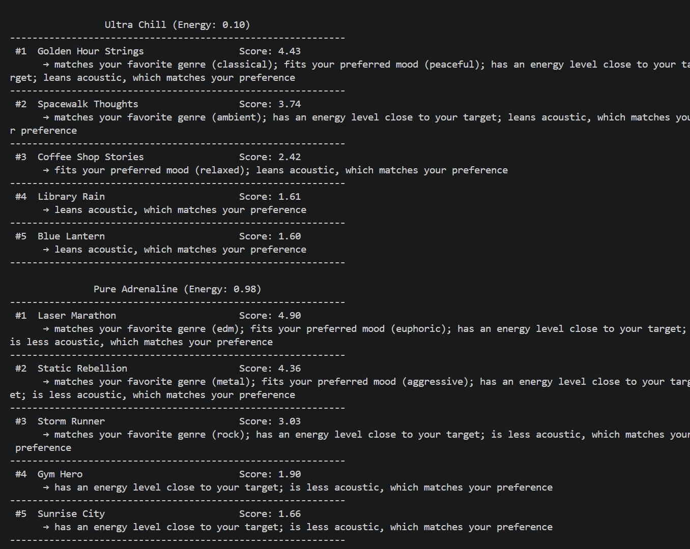
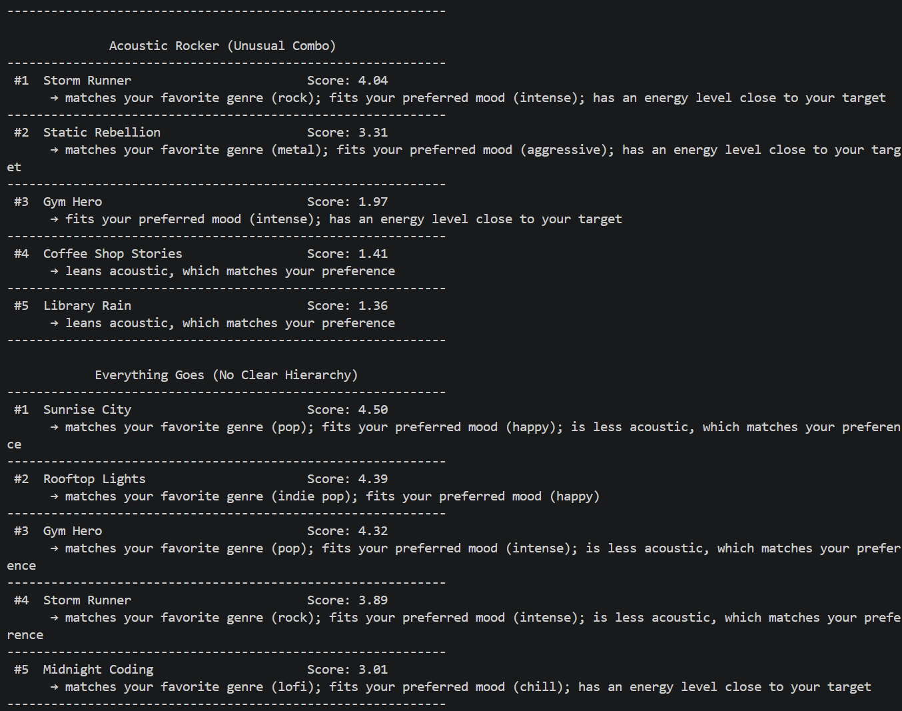

# 🎵 Music Recommender Simulation

## Project Summary

This project simulates a simple content-based music recommender. The system takes a user's preferred genre, mood, energy target, and acoustic preference, then ranks songs by a weighted similarity score. Recommendations include short explanations so each result is transparent and easy to understand.

---

## How The System Works

Real-world recommendation systems usually combine multiple signal types: content signals (genre, tempo, mood), behavior signals (likes, skips, watch/listen time), and collaborative patterns across many users. This simulation focuses on transparent, content-based matching, so it prioritizes how well a song's attributes match one user's stated preferences rather than large-scale behavior history.

Song object features used in this simulation:

- id
- title
- artist
- genre
- mood
- energy
- tempo_bpm
- valence
- danceability
- acousticness

UserProfile features used in this simulation:

- favorite_genre
- favorite_mood
- preferred_genres (ordered list for partial-credit matching)
- preferred_moods (ordered list for partial-credit matching)
- target_energy
- acoustic_preference

### Scoring Rule

For each song, the recommender computes an additive point score with a maximum of 5.0 using:

- genre match: up to 2.0 pts
- mood match: up to 1.0 pts
- energy closeness to target: up to 1.0 pts
- acousticness closeness to preference: up to 1.0 pts

Genre and mood use partial credit for lower-ranked preferences and substring matching (so "indie pop" matches "pop"). Numeric features use a closeness function — the nearer a song's value is to the target, the more points it earns.

For acousticness, the user sets a continuous preference target:

- acoustic_preference = 1.0 -> strongly acoustic
- acoustic_preference = 0.0 -> strongly non-acoustic
- acoustic_preference around 0.5 -> balanced acoustic/electric preference

After scoring all songs, the system sorts by score in descending order and returns the top k songs.

### Explanation Generation

Each recommendation includes a short explanation based on the strongest matched factors, for example genre match, mood match, close energy, or acoustic fit.

### Data Types in This Simulation

Main data types currently used:

- Song metadata: title, artist, genre, mood
- Audio-style numeric features: energy, tempo_bpm, valence, danceability, acousticness
- User preference inputs: favorite_genre, favorite_mood, preferred_genres, preferred_moods, target_energy, acoustic_preference

Data types not included yet:

- Explicit song likes/dislikes per user
- Skip history
- Play counts or repeat listens
- Playlist membership or co-listen behavior

This means the current system is content-based only. It ranks songs by feature similarity, not by behavioral interaction logs.

---

## Getting Started

### Setup

1. Create a virtual environment (optional but recommended):

   ```bash
   python -m venv .venv
   source .venv/bin/activate      # Mac or Linux
   .venv\Scripts\activate         # Windows

2. Install dependencies

```bash
pip install -r requirements.txt
```

3. Run the app:

```bash
python -m src.main
```

### Sample Output

```
Loaded songs: 18

             Top Recommendations
---------------------------------------------
 #1  Sunrise City                   4.75 / 5.00
      * genre match (+2.00)
      * mood match (+1.00)
      * energy closeness (+0.93)
      * acousticness closeness (+0.82)
---------------------------------------------
 #2  Rooftop Lights                 4.64 / 5.00
      * genre match (+2.00)
      * mood match (+1.00)
      * energy closeness (+0.99)
      * acousticness closeness (+0.65)
---------------------------------------------
 #3  Gym Hero                       3.77 / 5.00
      * genre match (+2.00)
      * energy closeness (+0.82)
      * acousticness closeness (+0.95)
---------------------------------------------
 #4  City Cipher                    1.85 / 5.00
      * energy closeness (+0.99)
      * acousticness closeness (+0.86)
---------------------------------------------
 #5  Night Drive Loop               1.78 / 5.00
      * energy closeness (+1.00)
      * acousticness closeness (+0.78)
---------------------------------------------
```

### Running Tests

Run the starter tests with:

```bash
pytest
```

You can add more tests in `tests/test_recommender.py`.

---

## Screenshots

Terminal outputs for all profile experiments are included below.









---

## Optional Extensions Mapping

This section maps the implemented extension work to optional rubric criteria.

### 1) Additional Song Attributes

The dataset includes more than the minimum required attributes in `data/songs.csv`:

- Core metadata: `id`, `title`, `artist`, `genre`, `mood`
- Numeric/music attributes: `energy`, `tempo_bpm`, `valence`, `danceability`, `acousticness`

Scoring uses multiple expanded attributes in `src/recommender.py`:

- `acousticness` (main weighted feature)
- `danceability` (optional tie-breaker)
- `valence` (optional tie-breaker)

### 2) Diversity / Novelty / Fairness Component

Implemented in `src/recommender.py` via diversity-aware reranking:

- Optional `diversify` switch
- Repeat penalties for artist and genre
- Adjustable penalties: `artist_repeat_penalty`, `genre_repeat_penalty`

Fairness and filter-bubble impact is documented in `model_card.md` under limitations/mitigations.

### 3) Multiple Ranking Modes (Modular)

Two ranking strategies are available through a modular path in `src/recommender.py`:

- Base mode: pure score sort (default)
- Diversity mode: greedy reranking with repeat penalties

Mode switching is exposed through user/profile preferences and demonstrated in `src/main.py` (for example, the `EVERYTHING_GOES` profile enables `diversify`).

### 4) Visual Output / Summary Table

Implemented in `src/main.py`:

- Formatted ASCII table output
- Columns include rank, song, score, and reasons
- Wrapped multi-line reason text for readability

Evidence screenshots are embedded above in the Screenshots section.

---

## User Preference Profiles

The recommender is tested with three distinct taste archetypes defined in `src/main.py`:

### High-Energy Pop
- Preferred genres: pop, funk, indie pop
- Preferred moods: happy, playful, confident
- Energy: 0.80 (high)
- Acoustic preference: 0.10

Example top recommendation: "Sunrise City" (pop, happy, 0.82 energy)

### Chill Lofi
- Preferred genres: lofi, ambient
- Preferred moods: chill, focused, peaceful
- Energy: 0.35 (very low)
- Acoustic preference: 0.90

Example top recommendation: "Library Rain" (lofi, chill, 0.35 energy, 0.86 acoustic)

### Deep Intense Rock
- Preferred genres: rock, metal, hip hop
- Preferred moods: intense, aggressive, confident
- Energy: 0.90 (very high)
- Acoustic preference: 0.05

Example top recommendation: "Storm Runner" (rock, intense, 0.91 energy)

### Edge Case / Adversarial Profiles

Five additional profiles stress-test the scoring logic with conflicting or boundary-value preferences:

**Conflicting Vibe (High Energy + Sad)**
- Energy: 0.90, Mood: melancholic
- Tests: Does the system rank low-energy songs (that match mood) over high-energy songs (that match energy preference)?
- Result: Genre and mood matches dominate; energy closeness is secondary. Blue Lantern (blues, low energy) scores higher than high-energy songs.

**Ultra Chill (Energy: 0.10)**
- Energy: 0.10 (boundary extreme)
- Tests: Can the system handle very low energy targets without breaking?
- Result: Golden Hour Strings (classical, 0.22 energy) scores highest. No numerical instability; scoring remains stable.

**Pure Adrenaline (Energy: 0.98)**
- Energy: 0.98 (boundary extreme)
- Tests: Can the system handle very high energy targets?
- Result: Laser Marathon (edm, 0.94 energy) scores highest. System handles high boundaries well.

**Acoustic Rocker (Unusual Combo)**
- Genre: rock, Acoustic preference: 0.80
- Tests: Do unusual preference combinations confuse the recommender?
- Result: Storm Runner (rock, non-acoustic) scores highest because genre/mood/energy match outweigh the acoustic mismatch. System prioritizes primary preferences.

**Everything Goes (No Clear Hierarchy)**
- Genres: ["pop", "rock", "lofi", "jazz", "edm", "classical"] (all equally valued)
- Tests: Do long preference lists cause all songs to score similarly?
- Result: Primary genre (pop) still dominates. Detailed ranking emerges; system does not become indifferent.

**Edge Case Conclusions:**
- The scoring logic is robust to conflicting preferences; dimensionality/weighting prevents mutual cancellation.
- Boundary energy values (0.10, 0.98) do not cause numerical instability.
- Long preference lists still produce meaningful differentiation.
- Primary (first-ranked) preferences carry more weight than secondary ones, so unusual combos do not "trick" the system.

These three profiles demonstrate the system's ability to differentiate between contrasting musical tastes. Run `python -m src.main` to see top-5 recommendations for all eight profiles.

---

## Experiments You Tried

### Taste Profile Critique

I tested this taste profile:

- genre: hip hop
- mood: confident
- energy: 0.78
- acoustic_preference: 0.10

To check whether the profile can separate contrasting styles, I compared one intense rock song with several chill lofi songs.

- Storm Runner (rock, intense): score 0.362
- Midnight Coding (lofi, chill): score 0.240
- Focus Flow (lofi, focused): score 0.227
- Library Rain (lofi, chill): score 0.200

Interpretation:

- The system does differentiate intense rock from chill lofi under this profile.
- Most of the separation comes from energy and acousticness closeness, not genre or mood matches.
- The profile is somewhat narrow because it uses one favorite genre and one favorite mood as exact matches.
- This can under-represent users who like multiple genres or different moods in different contexts.

### Design Decision Recorded

Decision: expand the profile to support multiple preferred genres and moods.

- New fields added: preferred_genres and preferred_moods.
- These lists are ordered, so the first preference gets full categorical credit and lower-ranked preferences get partial credit.
- Why: this makes the profile less narrow and better captures users who rotate between multiple genres/moods.
- Result: the recommender can still separate very different styles (like intense rock vs chill lofi), while better rewarding secondary tastes instead of treating them as complete mismatches.

---

## Limitations and Risks

Summarize some limitations of your recommender.

Examples:

- It only works on a tiny catalog
- It does not understand lyrics or language
- It might over favor one genre or mood

You will go deeper on this in your model card.

---

## Reflection

Completed artifacts:

- [Model Card](model_card.md)
- [Pairwise Reflection Notes](reflection.md)

These documents cover system design, evaluation, bias/mitigation analysis, and personal reflection.

Short personal reflection:

- Biggest learning moment: recommendation quality changed quickly when weights and matching rules changed, so design choices mattered more than algorithm complexity.
- How AI helped: AI sped up brainstorming, test drafting, and documentation, but I still validated numerical claims and ranking behavior with profile runs and pytest.
- What surprised me: a simple additive scorer still felt realistic, and songs like "Gym Hero" repeatedly surfaced for upbeat users for understandable feature reasons.
- What I would try next: add diversity-aware reranking, include tempo as an optional target, and run a small user study to compare perceived recommendation quality.


---

## 7. Model Card Template

The template guidance used for this assignment has been fully implemented in [model_card.md](model_card.md).

For quick review of requirement coverage:

- Intended Use: completed
- How the Model Works: completed
- Data: completed
- Strengths: completed
- Limitations and Bias: completed
- Evaluation: completed
- Future Work: completed
- Personal Reflection: completed

