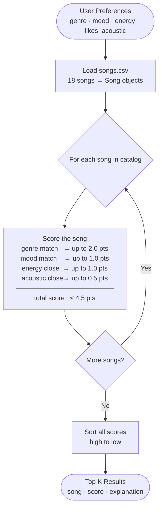

# 🎧 Model Card: Music Recommender Simulation

## 1. Model Name  

This is MY Jam 1.0

---

## 2. Intended Use  

Describe what your recommender is designed to do and who it is for. 

Prompts:  

- What kind of recommendations does it generate  
- What assumptions does it make about the user  
- Is this for real users or classroom exploration  

---

## 3. How the Model Works  

Explain your scoring approach in simple language.  

Prompts:  

- What features of each song are used (genre, energy, mood, etc.)  
- What user preferences are considered  
- How does the model turn those into a score  
- What changes did you make from the starter logic  

Avoid code here. Pretend you are explaining the idea to a friend who does not program.

Algorithm recipe: this recommender uses additive point scoring and ranking. Each song earns raw points across four features: a genre match is worth up to 2.0 points, a mood match up to 1.0 point, energy closeness up to 1.0 point, and acousticness closeness up to 1.0 point, for a maximum possible score of 5.0. Genre and mood use partial credit when a song matches a lower-ranked preference. Energy and acousticness use a closeness function — the nearer the song's value is to the user's target, the more points it earns. The four contributions are summed into one total score, all songs are sorted highest to lowest, and the top k results are returned with short explanations of the strongest matched factors.

Weighting rationale: genre counts twice as much as mood (2.0 vs 1.0) because genre is a strong long-term taste signal — most listeners have hard genre preferences — while mood is contextual and shifts with situation. Energy and acousticness are continuous signals that serve as meaningful tiebreakers between songs that already match on genre and mood.

Potential biases: because genre carries 2.0 points and mood only 1.0, a song that perfectly matches the user's mood but sits in the wrong genre will always rank below a genre-matching song — even if the mood fit is strong. This means the system may over-prioritize genre and surface familiar-sounding songs over ones that would actually feel right in the moment. Additionally, since energy and acousticness are the only continuous signals scored, qualities like danceability, tempo, and valence earn no points — genres that tend to score low on energy and acousticness (blues, country, reggae) may be systematically under-recommended even for users with broadly compatible tastes.

Data flow:

---

## 4. Data  

Describe the dataset the model uses.  

Prompts:  

- How many songs are in the catalog  
- What genres or moods are represented  
- Did you add or remove data  
- Are there parts of musical taste missing in the dataset  

---

## 5. Strengths  

Where does your system seem to work well  

Prompts:  

- User types for which it gives reasonable results  
- Any patterns you think your scoring captures correctly  
- Cases where the recommendations matched your intuition  

---

## 6. Limitations and Bias 

Where the system struggles or behaves unfairly. 

Prompts:  

- Features it does not consider  
- Genres or moods that are underrepresented  
- Cases where the system overfits to one preference  
- Ways the scoring might unintentionally favor some users  

---

## 7. Evaluation  

How you checked whether the recommender behaved as expected. 

Prompts:  

- Which user profiles you tested  
- What you looked for in the recommendations  
- What surprised you  
- Any simple tests or comparisons you ran  

No need for numeric metrics unless you created some.

---

## 8. Future Work  

Ideas for how you would improve the model next.  

Prompts:  

- Additional features or preferences  
- Better ways to explain recommendations  
- Improving diversity among the top results  
- Handling more complex user tastes  

One next step is to treat the new multi-genre and multi-mood preference lists as a first step toward hybrid preference modeling, then combine them with behavior signals (likes, skips, and playlist history) when that data becomes available.

---

## 9. Personal Reflection  

A few sentences about your experience.  

Prompts:  

- What you learned about recommender systems  
- Something unexpected or interesting you discovered  
- How this changed the way you think about music recommendation apps  

I asked Claude to help design a math-based scoring rule for my music recommender, and we chose a closeness approach for numeric features so songs score higher when they are nearer to the user’s target values, not simply higher or lower overall. For example, a song with energy very close to the user’s preferred energy gets more points than songs far above or below that target. We then combined numeric closeness with categorical matches (genre and mood) using additive point values, which keeps the model simple and interpretable. After comparing approaches, we moved from a normalized weight system (all weights summing to 1.0) to an explicit point recipe: genre is worth 2.0 points, mood 1.0, energy up to 1.0, and acousticness up to 0.5. The 2-to-1 genre-to-mood ratio was a deliberate design choice — genre tends to be a hard filter for most listeners while mood shifts with context. This process helped me understand how recommendation systems turn user preferences into measurable rules and how weight choices directly shape the final ranking.
