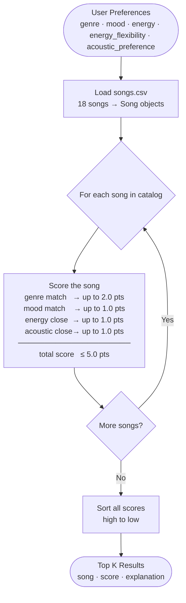

# 🎧 Model Card: Music Recommender Simulation

## 1. Model Name  

This is MY Jam 1.0

---

## 2. Intended Use  

Describe what your recommender is designed to do and who it is for. 

Prompts:  

- What kind of recommendations does it generate  
- What assumptions does it make about the user  
- Is this for real users or classroom exploration  

---

## 3. How the Model Works  

Explain your scoring approach in simple language.  

Prompts:  

- What features of each song are used (genre, energy, mood, etc.)  
- What user preferences are considered  
- How does the model turn those into a score  
- What changes did you make from the starter logic  

Avoid code here. Pretend you are explaining the idea to a friend who does not program.

Algorithm recipe: this recommender uses additive point scoring and ranking. Each song earns raw points across four features: a genre match is worth up to 2.0 points, a mood match up to 1.0 point, energy closeness up to 1.0 point, and acousticness closeness up to 1.0 point, for a maximum possible score of 5.0. Genre and mood use ranked partial credit with exponential decay (1.0, 0.8, 0.64, 0.51, ...), so secondary preferences continue to matter. Energy and acousticness use a closeness function — the nearer the song's value is to the user's target, the more points it earns. Energy closeness now supports a user-specific flexibility control (`energy_flexibility`), which widens or narrows the accepted energy range. Acoustic preference is modeled as a spectrum from 0.0 (prefers less acoustic) to 1.0 (prefers more acoustic), not a binary flag. The four contributions are summed into one total score, all songs are sorted highest to lowest, and the top k results are returned with short explanations of the strongest matched factors.

Weighting rationale: genre counts twice as much as mood (2.0 vs 1.0) because genre is a strong long-term taste signal — most listeners have hard genre preferences — while mood is contextual and shifts with situation. Energy and acousticness are continuous signals that serve as meaningful tiebreakers between songs that already match on genre and mood.

Potential biases: because genre carries 2.0 points and mood only 1.0, a song that perfectly matches the user's mood but sits in the wrong genre will always rank below a genre-matching song — even if the mood fit is strong. This means the system may over-prioritize genre and surface familiar-sounding songs over ones that would actually feel right in the moment. Additionally, since energy and acousticness are the only continuous signals scored, qualities like danceability, tempo, and valence earn no points — genres that tend to score low on energy and acousticness (blues, country, reggae) may be systematically under-recommended even for users with broadly compatible tastes.

Data flow:

---

## 4. Data  

Describe the dataset the model uses.  

Prompts:  

- How many songs are in the catalog  
- What genres or moods are represented  
- Did you add or remove data  
- Are there parts of musical taste missing in the dataset  

---

## 5. Strengths  

Where does your system seem to work well  

Prompts:  

- User types for which it gives reasonable results  
- Any patterns you think your scoring captures correctly  
- Cases where the recommendations matched your intuition  

---

## 6. Limitations and Bias 

Where the system struggles or behaves unfairly.

### Critical Filter Bubbles Identified

**1. Genre/Mood Dominance Creates Genre Lock-In (HIGH severity)**

Genre and mood together account for 60% of the max possible score (3.0 out of 5.0 points). This creates a strong genre bubble:

- A song that matches the user's preferred genre earns +2.0 points (40% of total), regardless of how well it matches energy or mood.
- A song in a non-preferred genre can earn at most 3.0 points (mood + energy + acousticness), even if it's perfect on all other dimensions.
- **Effect:** Users are trapped in their favorite genre. A user who loves pop will rarely see rock, jazz, or metal songs, even if a rock song has the exact energy and mood they want right now.

**Example:** Ultra Chill user (low energy target = 0.1) who loves lofi will be recommended more lofi songs even if a 0.12-energy ambient song would be a better match. Both are essentially the same energy, but lofi gets +2.0 genre points while ambient gets only 0.4 (secondary genre preference), so lofi dominates.

**2. Binary Acoustic Preference Acts as Hard Filter (HIGH severity) — MITIGATED**

Status: implemented in commit `fdd829f`.

Acoustic preference is now a continuous value (`acoustic_preference` in [0.0, 1.0]) scored by closeness, instead of a boolean.

- 0.0 means strongly non-acoustic preference
- 1.0 means strongly acoustic preference
- Mid values (for example 0.4 to 0.6) express mixed or flexible taste
- Legacy boolean input is still accepted and mapped to 0.0/1.0 for backward compatibility

Effect: acousticness is now a tunable preference rather than a hard gate, reducing the chance of hiding whole families of songs.

**3. Energy Closeness Gap Narrows Recommendations for Flexible Users (MEDIUM severity) — MITIGATED**

Status: implemented in the current codebase (Fix #3 rollout).

Energy scoring now includes `energy_flexibility` in [0.0, 1.0]. The model maps this to a dynamic energy range:

- `max_range = 0.5 + (0.5 * energy_flexibility)`
- flexibility 0.0 (strict) -> max_range 0.5
- flexibility 1.0 (flexible) -> max_range 1.0

Effect: users who are flexible on energy preserve stronger scores for farther energy values, reducing over-concentration in a narrow mid-energy band.

**4. Ranked Preference Decay Undervalues Secondary Tastes (MEDIUM severity) — MITIGATED**

Status: implemented in commit `c353b73`.

Ranked preferences now decay exponentially: `0.8 ** idx`.

- 1st: 1.00
- 2nd: 0.80
- 3rd: 0.64
- 4th: 0.51
- 5th: 0.41

Effect: secondary preferences retain meaningful influence without an abrupt floor, reducing over-concentration on only top-ranked tastes.

**5. No Serendipity or Diversity Mechanism (MEDIUM severity)**

The algorithm is greedy—it returns the highest-scoring songs every time.

- Top-5 will likely cluster around the same genre, mood, and narrow energy band.
- **Effect:** Users never discover new artists or styles, only deeper dives into what they already know. Perfect filter bubble reinforcement.

**6. Missing Continuous Features (MEDIUM severity)**

Danceability and valence (positivity) are loaded from the dataset but never scored. Tempo (BPM) is never scored.

- Songs with high danceability (for dance lovers) or high valence (for happy listeners) cannot be recommended based on these traits.
- **Effect:** Entire patterns of taste go unaddressed. A user who wants upbeat music has no explicit way to signal that; they must infer it through energy and mood alone.

### Suggested Fixes and Implementation Status

**Fix #1: Reduce Genre Weight & Add Diversity Penalty (addresses Filter Bubble #1 & #5)**

Change weights from (genre=2.0, mood=1.0, energy=1.0, acoustic=1.0) to (genre=1.0, mood=1.0, energy=1.0, acoustic=1.0).

Then add a diversity penalty to top-k selection: once a song is recommended, reduce the score of songs with the same genre by 0.3 × remaining_points. This encourages the top-5 to be more varied while still respecting preferences.

**Fix #2: Replace Boolean Acoustic with Spectrum (addresses Filter Bubble #2) — COMPLETED**

Instead of `likes_acoustic: bool`, use `acoustic_preference: float in [0.0, 1.0]`, where 0.0 = "prefers non-acoustic" and 1.0 = "prefers acoustic."

Score acousticness exactly like energy: `_closeness(user.acoustic_preference, song.acousticness)`.

This removes the hard filter and allows nuance (e.g., "I slightly prefer acoustic" = 0.6).

**Fix #3: Adjust Energy Range Based on User Flexibility (addresses Filter Bubble #3) — COMPLETED**

Accept an optional `energy_flexibility: float` parameter (default 0.5 = medium flexibility).

Use `max_range = 0.5 + (0.5 * energy_flexibility)` to adjust the closeness calculation. A user with flexibility=1.0 (very flexible) gets max_range=1.0, so farther energy values still retain credit. A user with flexibility=0.0 (rigid) gets max_range=0.5, so only closer values score highly.

**Fix #4: Slower Ranked Preference Decay (addresses Filter Bubble #4) — COMPLETED**

Change the decay formula from `1.0 - (0.2 * idx)` to `0.8 ** idx` (exponential decay with base 0.8).

- 1st: 0.8^0 = 1.0
- 2nd: 0.8^1 = 0.8
- 3rd: 0.8^2 = 0.64
- 4th: 0.8^3 = 0.51
- 5th: 0.8^4 = 0.41

No hard floor; even distant preferences contribute meaningfully.

**Fix #5: Add a Diversity Bonus to Top-K Selection (addresses Filter Bubble #5)**

Rerank top-k after scoring: once a song enters the top-5, penalize the remaining songs if they share genre/mood with any already-selected song. Use a small penalty (~0.1 points per shared dimension) to encourage variety without breaking overall preference ordering.

**Fix #6: Score Danceability and Valence (addresses Filter Bubble #6)**

Add optional user preferences for `target_danceability: float` and `target_valence: float` (default = None, so they don't affect users who don't specify).

When specified, score them the same way as energy: `_closeness(target_danceability, song.danceability)`.

Assign small weights (0.2 and 0.1) so they're tie-breakers, not dominant.

---

## 7. Evaluation  

How you checked whether the recommender behaved as expected. 

Prompts:  

- Which user profiles you tested  
- What you looked for in the recommendations  
- What surprised you  
- Any simple tests or comparisons you ran  

No need for numeric metrics unless you created some.

---

## 8. Future Work  

Ideas for how you would improve the model next.

**Immediate priority: mitigate remaining filter bubbles identified in Section 6.**

- ✅ Introduced slower ranked preference decay (exponential instead of linear) so secondary tastes have real impact.
- ✅ Replaced boolean acoustic preference with a spectrum (0.0–1.0), removing the hard filter.
- ✅ Added user energy flexibility so contextual energy preferences are supported.
- Score missing features (danceability, valence) for users who care about them.
- Implement diversity penalty in top-k selection to reduce genre/mood clustering.

**Medium-term enhancements:**

- Treat the new multi-genre and multi-mood preference lists as a first step toward hybrid preference modeling, then combine them with behavior signals (likes, skips, and playlist history) when that data becomes available.
- A/B test different weight schemes to find the balance between personalization and serendipity.
- Add temporal context: users might want different energy/mood at different times of day or for different activities.
- Compare recommendations to real services (Spotify, Apple Music) to validate whether the system matches user expectations.

---

## 9. Personal Reflection  

A few sentences about your experience.  

Prompts:  

- What you learned about recommender systems  
- Something unexpected or interesting you discovered  
- How this changed the way you think about music recommendation apps  

I asked Claude to help design a math-based scoring rule for my music recommender, and we chose a closeness approach for numeric features so songs score higher when they are nearer to the user’s target values, not simply higher or lower overall. For example, a song with energy very close to the user’s preferred energy gets more points than songs far above or below that target. We then combined numeric closeness with categorical matches (genre and mood) using additive point values, which keeps the model simple and interpretable. After comparing approaches, we moved from a normalized weight system (all weights summing to 1.0) to an explicit point recipe: genre is worth 2.0 points, mood 1.0, energy up to 1.0, and acousticness up to 1.0. The 2-to-1 genre-to-mood ratio was a deliberate design choice — genre tends to be a hard filter for most listeners while mood shifts with context. This process helped me understand how recommendation systems turn user preferences into measurable rules and how weight choices directly shape the final ranking.
